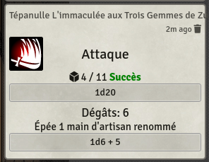
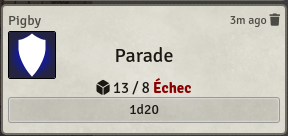

# Module foundry pour Naheulbook (Naheulbeuk)

## Description

Ce module ajoute un lien entre foundry et Naheulbook afin de connecté les statistique des token avec les personnages
déjà présent dans Naheulbook.

## Fonctionnalités

- Monstres et Personnages synchronisés entre Naheulbook et Foundry
- Macros pour utiliser les effectuer les attaque / parade simplement


- Outil pour créer des macros simplement


## Developpement

```shell
npm install
npm run dev
```

Crée un lien symbolique dans le dossier `systems` de foundry vers le dossier `dist/`.
- sur Linux: `ln -s dist/ ~.local/share/FoundryVTT/Data/systems/naheulbook`

## Notes

- Plus d'infos sur Naheulbeuk: http://naheulbeuk.com/
